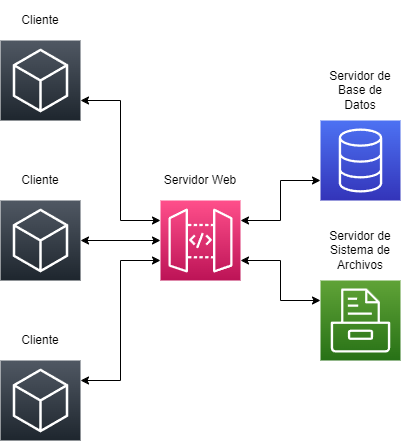

# Proyecto Integrador de Redes y Sistemas Operativos

## Descripción

Este repositorio contiene un proyecto estudiantil de Redes de Comunicación de Datos y Sistemas Operativos que se centra en el desarrollo de un sistema de Recursos Humanos distribuido. El objetivo principal de este proyecto es proporcionar una aplicación escalable y segura para organizaciones con diferentes roles de usuarios.

El sistema ofrece diferentes niveles de permisos y roles de usuarios, incluyendo empleados, supervisores, gerentes, administradores y desarrolladores. Cada rol tiene distintos privilegios y acceso a diferentes funcionalidades dentro del sistema.

La aplicación se ha diseñado como una gran aplicación distribuida, en la cual cada servidor ejecuta un microservicio específico. La comunicación entre los microservicios se realiza mediante mensajes HTTP.

El microservicio principal es el "Web", encargado de comunicarse directamente con los clientes, servir páginas web, ser intermediario y comunicarse con otros microservicios.

Otro microservicio es el "File System", responsable de la creación y autenticación de usuarios. Utiliza un sistema de archivos basado en FAT, con directorios y permisos para cada archivo. Además, emplea el algoritmo de encriptación SHA-256 para proteger las contraseñas de los usuarios.

El tercer microservicio es el "Database", implementado con SQLite, que se encarga de almacenar los datos relacionados con Recursos Humanos, como solicitudes, información personal y laboral. También proporciona funciones para editar y eliminar datos. 

Para utilizar el programa, los usuarios deben acceder a través de un navegador web utilizando la dirección IP del microservicio "Web". Una vez autenticados, los usuarios pueden realizar diversas consultas, como información personal, anotaciones en el expediente, solicitudes creadas y saldo de vacaciones. Además, el sistema permite realizar diversas solicitudes, como constancias laborales, constancias salariales, comprobantes de pago y solicitudes de vacaciones.

El repositorio incluye los diferentes programas necesarios para ejecutar cada uno de los servidores correspondientes a los microservicios mencionados. Además, se proporciona una configuración para las direcciones IP y puertos de los servidores en un archivo específico.

[Enlace al Documento de Google](https://docs.google.com/document/d/10L8kM7qYIKsOVK85LlFsSmQQPOhCoMRJuhMxhY76kJw/edit)

## Manual de usuario

Diríjase al documento [Manual de usuario](./documentation/user_manual.md)

## Integrantes

- David Cerdas Alvarado C02001
david.cerdasalvarado@ucr.ac.cr

- Ángel Chaves Chinchilla C12113
angel.chaveschinchilla@ucr.ac.cr

- Ignacio Robles Mayorga B96549
ignacio.robles@ucr.ac.cr

- Camilo Suárez Sandí C17811
camilo.suarez@ucr.ac.cr
