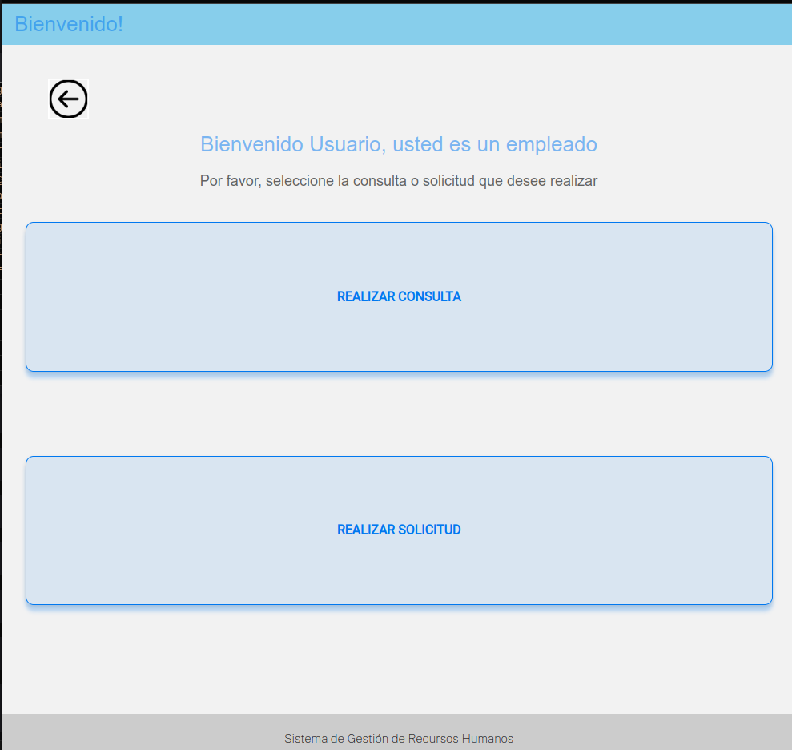

# Manual de usuario

Este documento ofrece una guía completa para poder ejecutar el sistema en diferentes terminales de comando o en diferentes dispositivos. Además explica las funcionalidades de las pantallas más significativas del sitio web.

## 1. Instalación

### 1.1. Requerimientos mínimos de Hardware

* Procesador: Core i3  
* Memoria: 2GB de RAM  
* Almacenamiento: 1MB  

### 1.2 Requerimientos de Software

* Sistema operativo: Distribución de Linux  
* El compilador GCC 12.2  
* La herramienta Make
* Dependencias adicionales (ver sección **1.3 Instalación de dependencias**)

### 1.3 Instalación de dependencias

Abra una terminal y ubíquese en la carpeta del proyecto, después proceda a ejecutar el comando `make install` el cuál instalará las siguientes dependencias:

* python3
* python3-pip
* cpplint
* Las especificados en la variable `DEPENDENCIES` del archivo [Makefile](../Makefile)

## 2. Ejecución

### 2.1 Archivos de configuración

Antes de mostrar ejemplos de ejecución, es importante entender la funcionalidad de los archivos de configuración ubicados en la carpeta [test](../test/), tomaremos como ejemplo el archivo [configuration_web.json](../test/configuration_web.json) que contiene lo siguiente:

```json
{
    "apps": [
        "web"
    ],
    "port": 8080,
    "servers": {
        "web": {
            "address": "127.0.0.1",
            "port": 8001
        },
        "fs": {
            "address": "127.0.0.1",
            "port": 8002
        },
        "db": {
            "address": "127.0.0.1",
            "port": 8003
        },
        "default": {
            "address": "127.0.0.1",
            "port": 8000
        }
    }
}
```

1. La propiedad `apps` indica cuál servidor será configurado por este archivo, en este caso configurará el servidor web.
2. La propiedad `servers` contiene características de este servidor y de los demás servidores:

    a. Propiedad `web`: el `address` (para este ejemplo) será la dirección IP del `localhost` ya que el servidor web será el que corra en el dispocitivo actual. El `port` indica el puerto en que estará escuchando el servidor web.

    b. Propiedad `fs`: el `address` será la dirección IP en que el servidor del FileSystem estará ejecutándose y el `port` indica el puerto en que el servidor del FileSystem estará escuchando por conexiones.

    c. Propiedad `db`: Representa los mismo que la propiedad `fs` pero para el servidor de DataBase


### 2.2 En un dispositivo

Si desea ejecutar el sistema en un solo dispositivo, primero debe tener en claro que el servidor web, el servidor de base de datos y el servidor de filesystem escuchan por conexiones en distintos puertos, por lo tanto se ofrece archvivos de configuración donde puede indicar el puerto en que desea que cada servidor escuche por conexiones, los pasos a seguir son los siguientes:

1. Configure los archivos de configuración ubicados en la carpeta [test](../test/):

Cada archivo de configuración especifica la dirección IP y el puerto en que cada servidor escuchará por conexiones, para el ejemplo de un solo dispotivo las direcciones IP siempre serán `127.0.0.1` para indicar que el servidor corre en el *localhost*. Puede modificar los puertos en que escuchan los servidores, tome en cuenta que estas modificaciones tendrá que hacerlas en los 3 archivos de configuración para que los servidores puedan comunicarse entre si.

Un ejmplo de cómo se verían los archivos de configuración para la ejecución en un sólo dispositivo es el siguiente:

Archivo [configuration_web](../test/configuration_web.json):

```json
{
    "apps": [
        "web"
    ],
    "port": 8080,
    "servers": {
        "web": {
            "address": "127.0.0.1",
            "port": 8001
        },
        "fs": {
            "address": "127.0.0.1",
            "port": 8002
        },
        "db": {
            "address": "127.0.0.1",
            "port": 8003
        },
        "default": {
            "address": "127.0.0.1",
            "port": 8000
        }
    }
}
```

Archivo [configuration_db](../test/configuration_db.json):

```json
{
    "apps": [
        "db"
    ],
    "port": 8080,
    "servers": {
        "web": {
            "address": "127.0.0.1",
            "port": 8001
        },
        "fs": {
            "address": "127.0.0.1",
            "port": 8002
        },
        "db": {
            "address": "127.0.0.1",
            "port": 8003
        },
        "default": {
            "address": "127.0.0.1",
            "port": 8000
        }
    }
}
```

Archivo [configuration_fs](../test/configuration_fs.json):

```json
{
    "apps": [
        "fs"
    ],
    "port": 8080,
    "servers": {
        "web": {
            "address": "127.0.0.1",
            "port": 8001
        },
        "fs": {
            "address": "127.0.0.1",
            "port": 8002
        },
        "db": {
            "address": "127.0.0.1",
            "port": 8003
        },
        "default": {
            "address": "127.0.0.1",
            "port": 8000
        }
    }
}
```

2. Abra 3 terminales ubicadas en el directorio del proyecto, cada una de estas ejecutará un servidor distinto.

3. Ejecute los siguientes comandos dependiendo de la terminal:

Terminal 1:

`make run ARGS="test/configuration_web.json"`

Terminal 2:

`make run ARGS="test/configuration_fs.json"`

Terminal 3:

`make run ARGS="test/configuration_db.json"`

4. Abra el navegador web de su preferencia y escriba la URI `http://127.0.0.1:8001/`, de esta forma podrá hacer uso de las funcionalidades del sistema las cuales son explicadas en la sección **3. Guía de funcionalidades** de este documento.


### 2.3 En varios dispositivos

Para ejecutar en varios dispositivos, compilar el programa y ejecutar en cada uno de los dispositivos, es necesario configurar los servidores con las direcciones de los otros dispositivos, los pasos serían los siguiente:

1. Configure los archivos de configuración ubicados en la carpeta [test](../test/) tomando en cuenta lo expuesto en la sección **2.1 Archivos de configuración**

Un ejemplo de los archivos de configuración sería el siguiente:

Dispositivo A con dirección IP `192.168.1.11`:
```json
{
    "apps": [
        "web"
    ],
    "servers": {
        "fs": {
            "address": "192.168.1.12",
            "port": 8000
        },
        "db": {
            "address": "192.168.1.13",
            "port": 8000
        },
        "web": {
            "address": "127.0.0.1",
            "port": 8000
        }
    }
}
```

Dispositivo B con dirección IP `192.168.1.12`:
```json
{
    "apps": [
        "fs"
    ],
    "servers": {
        "web": {
            "address": "192.168.1.11",
            "port": 8000
        },
        "db": {
            "address": "192.168.1.13",
            "port": 8000
        },
        "fs": {
            "address": "127.0.0.1",
            "port": 8000
        }
    }
}
```

Dispositivo C con dirección IP `192.168.1.13`:
```json
{
    "apps": [
        "db"
    ],
    "servers": {
        "web": {
            "address": "192.168.1.11",
            "port": 8000
        },
        "fs": {
            "address": "192.168.1.12",
            "port": 8000
        },
        "db": {
            "address": "127.0.0.1",
            "port": 8000
        }
    }
}
```

2. Abra una terminal por dispotivo, ubicándose en el directorio del proyecto, cada una de estas ejecutará un servidor distinto.

3. Ejecute los siguientes comandos dependiendo del dispotivo:

Terminal Dispositivo A:

`make run ARGS="test/configuration_web.json"`

Terminal Dispositivo B:

`make run ARGS="test/configuration_fs.json"`

Terminal Dispositivo C:

`make run ARGS="test/configuration_db.json"`

4. Abra el navegador web de su preferencia en un dispotivo pertenience a la misma red del servidor web y escriba la URI `http://192.168.1.11:8001/` (esta URI es dependiente de las direcciones IP y puertos especificados en los archivos de configuración), de esta forma podrá hacer uso de las funcionalidades del sistema las cuales son explicadas en la sección **3. Guía de funcionalidades** de este documento.

## 3. Guía de funcionalidades

### 3.1 Login


El usuario indicará su nombre de usuario y contraseña, de acuerdo a sus permisos será redirigido a una página con las funcionalidades disponibles. Los datos de autenticación son almacenados en el servidor del File System por lo que este servidor debe estar corriendo y tener los datos actualizados para que se pueda acceder al sistema.

### 3.2 Usuario Empleado



El usuario empleado tendrá las opciones generales para la mayoría de usuarios del sistema, podrá realizar consultas como:

* Salario Base
* Anotaciones al expediente
* Estado de solicitudes
* Saldo de vacaciones.

También podrá realizar solicitudes como:

* Constancia Salarial
* Constancia Laboral
* Comprobantes de pago
* Solicitud de vacaciones

### 3.3 Usuario Supervisor


Tiene las funcionalidades especificadas para el empleado, además una opcion para aprobar o desaprobar solicitudes realizadas en un área específica (para nuestro ejemplo de sistema, un área es una provincia de Costa Rica) y otra opción para crear anotaciones a un empleado específico.

### 3.4 Usuario Administrador


Tiene las funcionalidades especificadas para el empleado, además opciones para:

* Agregar usuario: Crea los datos personales y de autenticación del usuario, estos se almacenan en los respectivos servidores.
* Editar usuario: Permite editar datos personales o datos de autenticación del usuario.
* Borrar usuario: Elimina al usuairo del sistema a partir de su username almacenado en el servidor de autenticación (servidor FileSystem).

### 3.4 Usuario Auditor

Este usuario sólo tendrá la función de revisar las bitácoras generadas en los distintos servidores debido a que puede ser un ente externo a la empresa que no esté registrado en planilla como un empleado de la compañía.


